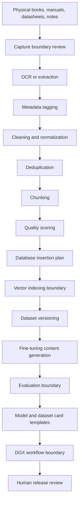

# Public-Safe Source-To-Model Workflow

Status: scaffolded

## Problem Statement

Data/model infrastructure needs a clear public-safe path from source capture to model/dataset card readiness without exposing private corpora, copyrighted material without rights, customer data, Foundation-private data, private weights, adapters, private training logs, endpoints, topology, credentials, unreleased metrics, private prompts, or private eval outputs.

This artifact asks: how can a source-to-model workflow be documented as architecture and review discipline without claiming a model release, dataset release, Space release, benchmark result, or Hugging Face metadata change?

## Synthetic Source Context

The workflow uses a fictional engineering reference set:

- synthetic public-safe notes;
- generic manual-like excerpts written for the scaffold;
- generic datasheet-style metadata without real vendor content;
- synthetic source records and review states.

The workflow does not include copyrighted material without rights, private scans, private corpora, customer records, Foundation-private material, internal company product names, endpoints, topology, credentials, private prompts, private eval outputs, unreleased metrics, private weights, adapters, or private training logs.

## Source-To-Model Workflow

| Step | Public-safe action | Boundary |
| --- | --- | --- |
| Physical books / manuals / datasheets / notes | Classify source type, rights posture, and review need before capture. | No copyrighted material without rights or private corpora. |
| Capture | Use scanning or digital capture only for synthetic or reviewed public-safe material. | No customer data or Foundation-private data. |
| OCR / extraction | Extract text into reviewable synthetic records. | No private scanned material or private prompts. |
| Metadata tagging | Add source class, rights posture, boundary class, quality state, and review state. | No private source records or customer identifiers. |
| Cleaning and normalization | Normalize public-safe text and preserve boundary metadata. | No private text or sealed transformation rules. |
| Deduplication | Compare synthetic identifiers and review metadata. | No private hashes, private corpora, or internal dataset statistics. |
| Chunking | Segment synthetic records while carrying provenance and boundary fields. | No private corpus excerpts. |
| Quality scoring | Review provenance, rights, extraction quality, completeness, and risk. | No benchmark or model-quality claim. |
| Database insertion | Insert conceptual records into a schema plan. | No endpoints, topology, credentials, or production schemas. |
| Vector indexing | Describe pgvector/Qdrant-style indexing boundaries. | No private embeddings, private index contents, or unreleased metrics. |
| Dataset versioning | Track synthetic dataset versions and review state. | No released dataset claim. |
| Fine-tuning content generation | Prepare synthetic instruction/content candidates for review. | No private weights, adapters, private training logs, or private corpora. |
| Evaluation | Define eval report structure and limitations. | No benchmark claim, private eval output, or unreleased metric. |
| Model/dataset cards | Prepare template-only release-surface documentation. | No model release, dataset release, Space release, or metadata change. |
| DGX workflow boundary | Document public-safe review gates for DGX-style workflows. | No runtime details, endpoints, topology, credentials, private weights, adapters, or training logs. |

## Mermaid Workflow Diagram

## Validation Questions

- Is the source synthetic, public-safe, or reviewed with rights?
- Does the workflow avoid private corpora and copyrighted material without rights?
- Does it avoid customer data and Foundation-private data?
- Does it avoid private weights, adapters, private training logs, endpoints, topology, credentials, and unreleased metrics?
- Does it avoid private prompts and private eval outputs?
- Are model/dataset cards clearly templates rather than releases?
- Is Hugging Face treated only as a release surface requiring later human review?
- Is human review required before public routing or metadata changes?

## What This Proves

- A data/model infrastructure repo can document source capture, OCR, metadata, cleaning, deduplication, chunking, quality scoring, database insertion, vector indexing, dataset versioning, fine-tuning content generation, evaluation, cards, and DGX workflow boundaries without exposing private material.
- The workflow can preserve provenance, rights posture, boundary class, and review state through every stage.
- Hugging Face documentation can be handled as template-only release-surface discipline.

## What This Does Not Prove

- It does not release a dataset.
- It does not release a model.
- It does not release a Space.
- It does not change Hugging Face metadata.
- It does not prove benchmark results.
- It does not expose or validate private training runs.
- It does not prove deployment readiness, product readiness, certification, or proof completion.
- It does not authorize use of copyrighted material without rights.

## Public / Private / Sealed Checklist

| Check | Status |
| --- | --- |
| Uses only synthetic/public-safe source context | scaffolded |
| Excludes private corpora | scaffolded |
| Excludes copyrighted material without rights | scaffolded |
| Excludes customer data | scaffolded |
| Excludes Foundation-private data | scaffolded |
| Excludes private weights and adapters | scaffolded |
| Excludes private training logs | scaffolded |
| Excludes endpoints, topology, and credentials | scaffolded |
| Excludes unreleased metrics | scaffolded |
| Excludes private prompts and private eval outputs | scaffolded |
| Excludes model/dataset/Space release claims | scaffolded |
| Excludes Hugging Face metadata changes | scaffolded |
| Requires human review before public routing | scaffolded |

## Boundary

No private corpora, copyrighted material without rights, customer data, Foundation-private data, private weights, adapters, private training logs, endpoints, topology, credentials, unreleased metrics, private prompts, private eval outputs, released model claims, released dataset claims, or Hugging Face metadata changes are included.
